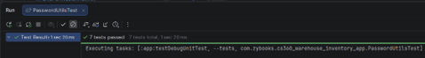
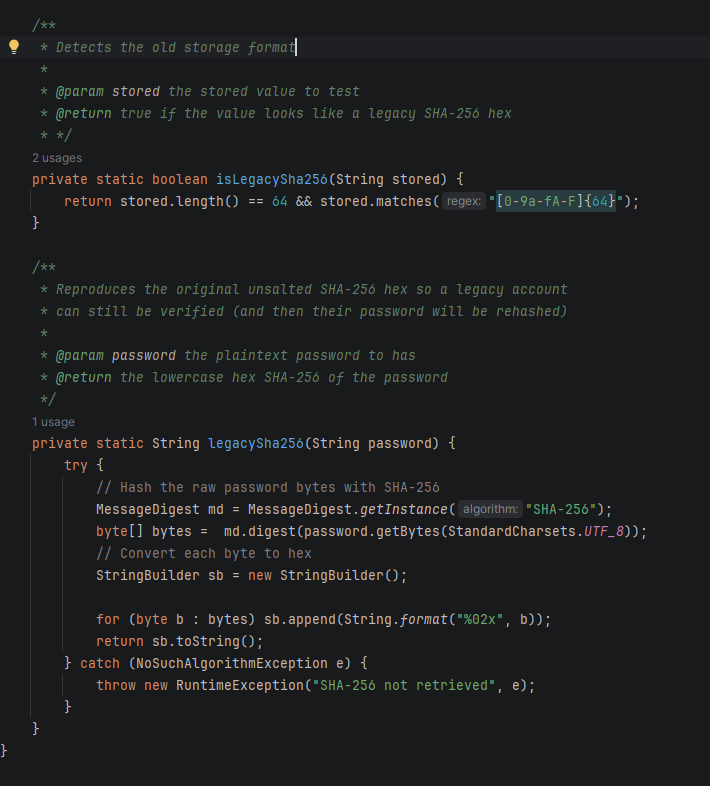
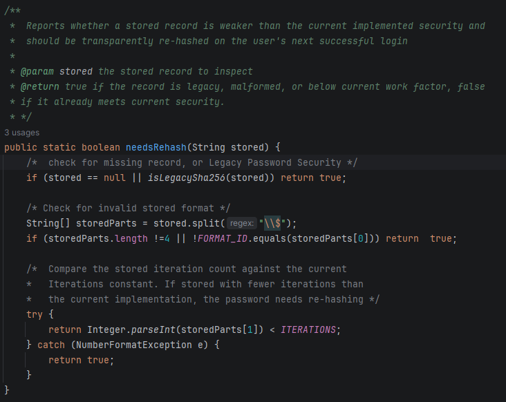
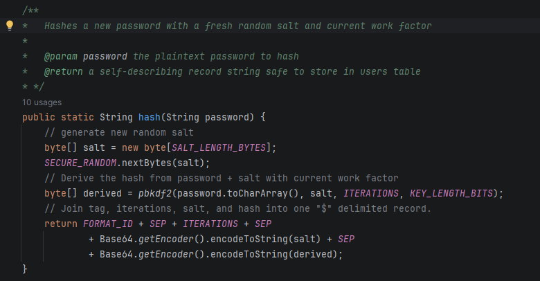
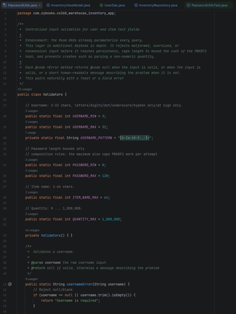
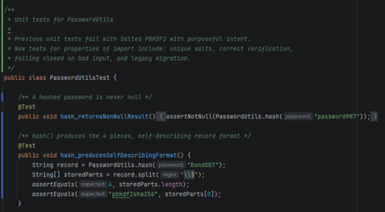
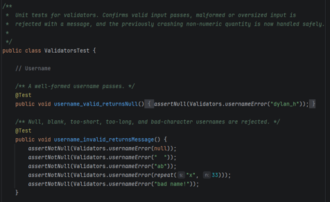
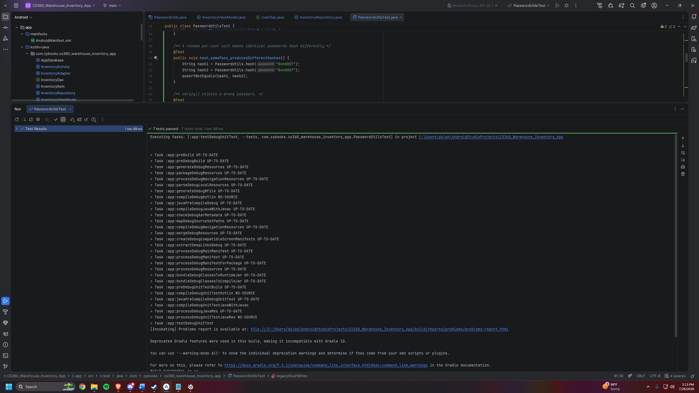

[](https://www.java.com)
[](https://developer.android.com)
[](https://developer.android.com/training/data-storage/room)
[](https://junit.org)

---

## Enhancement One: Software Design and Engineering
### Warehouse Inventory App &mdash; CS-360 Mobile Architecture and Programming

---

<div align="center">
  <a href="https://github.com/DPHarmon/DPHarmon.github.io/tree/main/enhancement/CS360-Inventory-Mobile-App" title="Warehouse Inventory App {Original/Enhanced}">
    
  </a>
</div>

### The artifact

The Warehouse Inventory App is an Android application that lets warehouse
employees create an account and log in, then add, update, and delete items in a
local database. The app sends an SMS alert when an item's quantity reaches zero.
It is written in Java on the standard Android stack: a SQLite database accessed
through Room, a repository and ViewModel following the MVVM pattern, and
RecyclerView-driven screens for the login flow and the inventory list. I built
the original in April 2026 as the final project for CS-360.

### Why this artifact

The app was already a complete layered application &mdash; user authentication,
a permission-gated SMS feature, and user input flowing into a Room database.
That made it the right candidate for a security enhancement rather than a
rewrite: the structure was sound, and the weakness was in how it handled
credentials and input. It let me demonstrate refactoring existing code toward a
different authentication design instead of building something new and calling it
an improvement.

---

### Password storage

The original app stored passwords as a plain SHA-256 hash. I replaced that with
salted, iterated PBKDF2-HMAC-SHA256. Every password now gets a unique random
salt, and the derived hash is stored in a self-describing record:

```
pbkdf2sha256$<iterations>$<base64 salt>$<base64 hash>
```

Storing the parameters alongside the hash means they can evolve later without a
database migration.

<div align="center">
  
  <p><em>Figure 1 - PasswordUtils: PBKDF2 derivation with a per-password salt</em></p>
</div>

Verification uses a constant-time comparison. A constant-time implementation
prevents timing attacks by ensuring execution time does not depend on secret
data, removing measurable differences an attacker could use to infer
information about a stored credential.

<div align="center">
  
  <p><em>Figure 2 - Verification with constant-time comparison</em></p>
</div>

### Migrating existing accounts

Changing a hashing algorithm is easy. Changing it without locking out every user
who already has an account is the actual problem, and solving it was the part of
this enhancement I learned the most from.

I used *lazy migration*, a technique where data is converted during the
application's normal operation rather than in a single bulk conversion. As
Davis (2018) describes it, the migration moves data from one state to another
while applying the operations that bring it in line with updated business rules.
Here the updated rule is a security policy: when a user logs in, their stored
hash is checked against the current policy. If it is the old unsalted format, or
was derived with fewer iterations than the policy now requires, the password is
re-hashed to the current standard on that login.

<div align="center">
  
  <p><em>Figure 3 - Detecting a credential stored under the previous scheme</em></p>
</div>

<div align="center">
  
  <p><em>Figure 4 - Checking a stored hash against the current security policy</em></p>
</div>

<div align="center">
  
  <p><em>Figure 5 - The credential is transparently upgraded on the user's next login</em></p>
</div>

The assumption behind this choice is that in my next role I will be working on
existing code, where upgrading security means making the new work with the old.

### Permissions

I modified the manifest to follow the principle of least privilege, removing a
notifications permission the app never used. I moved the runtime SMS request
from Android's older callback API to the current `ActivityResultLauncher`, and
added handling for the "don't ask again" case so a user who has permanently
blocked the permission is guided to settings rather than hitting a dead end.

### Input validation

The final component was a `Validators` class enforcing rules on usernames,
passwords, item names, and quantities before any input reaches the database.
This also fixed a crash where non-numeric quantity input threw an unhandled
exception, and it protects against injection-style input as a defense-in-depth
measure.

<div align="center">
  
  <p><em>Figure 6 - The Validators class</em></p>
</div>

One adjustment from my original enhancement plan: I had proposed adding
parameterized queries to the data layer to prevent injection. Room already
parameterizes every query and validates it at compile time, so that work was
unnecessary. I redirected the effort into the validation layer instead.

### Testing

<div align="center">
  
  <p><em>Figure 7 - JUnit coverage for the hashing and verification logic</em></p>
</div>

<div align="center">
  
  <p><em>Figure 8 - JUnit coverage for the input validation rules</em></p>
</div>

<div align="center">
  
  <p><em>Figure 9 - Full suite passing</em></p>
</div>

---

### Course outcomes

**Develop a security mindset that anticipates adversarial exploits in software
architecture and designs to expose potential vulnerabilities, mitigate design
flaws, and ensure privacy and enhanced security of data and resources.**

The entire enhancement is evidence for this outcome. I approached the app by
asking how an adversary would attack it: offline brute force, timing side
channels, injection-style input, and denial of service through an oversized
password. Strengthening password storage, validating input, and enforcing least
privilege are each a response to one of those.

**Design and evaluate computing solutions that solve a given problem using
algorithmic principles and computer science practices and standards appropriate
to its solution, while managing the trade-offs involved in design choices.**

The clearest example is the PBKDF2 work factor. Current OWASP guidance
recommends a very high iteration count, but that guidance targets server-side
hashing. OWASP also notes that choosing a work factor means balancing security
against performance, and that the right value depends on the hardware and the
number of users. This app verifies logins on the device, where an iteration
count that high adds seconds of latency to every sign-in. I made the count a
single named constant, chose a value balancing brute-force resistance against a
responsive login, and documented the reasoning in comments so the decision can
be revisited.

**Demonstrate an ability to use well-founded and innovative techniques, skills,
and tools in computing practices for the purpose of implementing computer
solutions that deliver value and accomplish industry-specific goals.**

I used established mechanisms rather than inventing my own: PBKDF2 through
Java's `SecretKeyFactory`, lazy migration as a documented pattern, constant-time
comparison as a standard cryptographic practice, the current Android permission
API, and JUnit to verify every change.

---

### Reflection

The main thing I learned is that I enjoy working with security. The difference
between the original unsalted SHA-256 hash and a salted, non-deterministic one
is stark once you see it in practice. I first learned about cryptographic
hashing a year ago and found SHA-256 fascinating on its own terms; this
enhancement was the first time I got to build something with a security-first
mindset rather than write a report about one.

Designing the legacy path is what made the lesson concrete. You cannot simply
change an algorithm and lock out every user who registered before you did. That
shift &mdash; from *does it work* to *how does it fail, and for whom* &mdash; is
what I took away most from this enhancement.

---

### Sources

Android. (2024). *ActivityResultLauncher*. Android Developers.
[https://developer.android.com/reference/androidx/activity/result/ActivityResultLauncher](https://developer.android.com/reference/androidx/activity/result/ActivityResultLauncher)

Davis, E. G. (2018). *Lazy migration applied to software applications*. Medium.
[https://medium.com/@eduardogulias/lazy-migration-applied-to-software-applications-27939ba8f375](https://medium.com/@eduardogulias/lazy-migration-applied-to-software-applications-27939ba8f375)

Kumar, S. (2025). *Constant time implementation for cryptography*. Medium.
[https://medium.com/@chmodshubham/constant-time-implementation-for-cryptography-68d42e3dcd23](https://medium.com/@chmodshubham/constant-time-implementation-for-cryptography-68d42e3dcd23)

OWASP. (2021). *Password storage cheat sheet*. OWASP Cheat Sheet Series.
[https://cheatsheetseries.owasp.org/cheatsheets/Password_Storage_Cheat_Sheet.html](https://cheatsheetseries.owasp.org/cheatsheets/Password_Storage_Cheat_Sheet.html)

Stefanovskyi, O. (2019). *How to keep passwords safe using PBKDF2 hashing algorithm in Java*. Medium.
[https://medium.com/@stefanovskyi/how-to-keep-passwords-safe-using-pbkdf2-f23700710ec3](https://medium.com/@stefanovskyi/how-to-keep-passwords-safe-using-pbkdf2-f23700710ec3)

---

<div align="right">
  <a href="/">&#8592; Back to ePortfolio Home</a>
</div>
