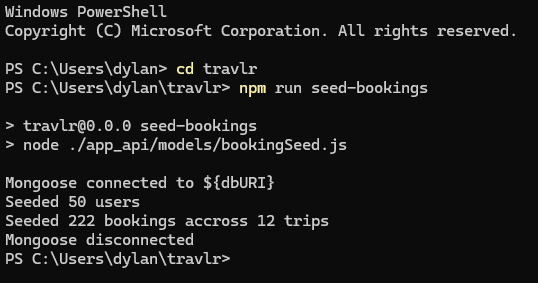
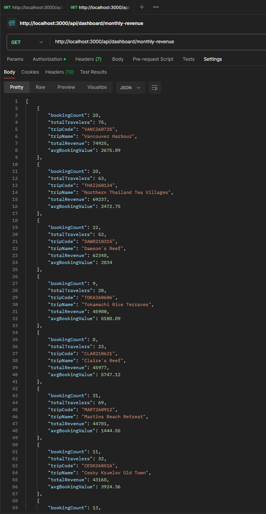
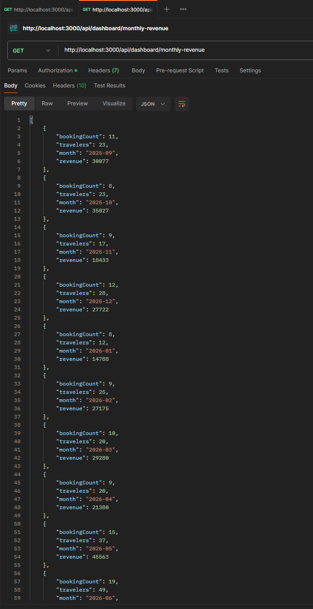
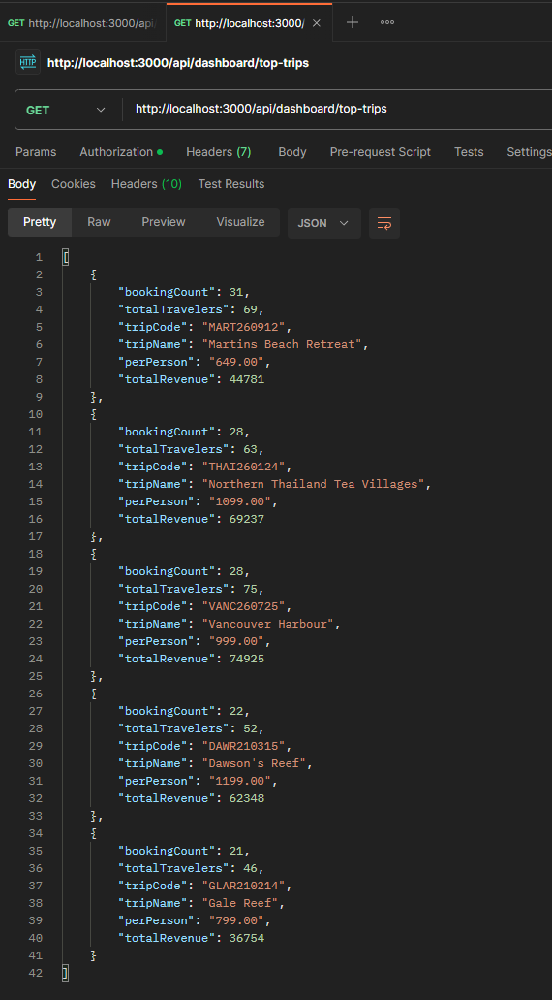
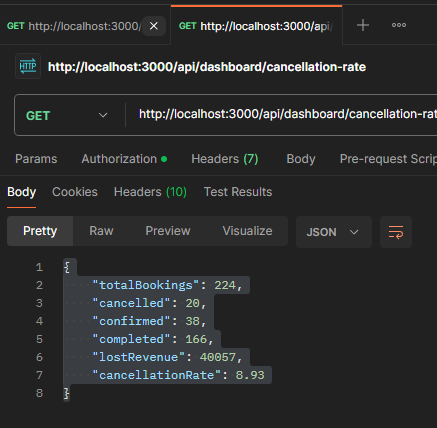

---

## Enhancement Three: Databases
### Travlr Getaways &mdash; CS-465 Full Stack Development I

---

  

### The artifact

Travlr Getaways is a MEAN stack travel booking application, finished in June 2026
just before this capstone. Three parts share one Express server: a
customer-facing site rendered with Handlebars templates, a REST API backed by
MongoDB, and an Angular single-page application for admins to manage the trip
catalog. The API protects its write endpoints with JSON Web Tokens, and
passwords are stored with PBKDF2.

### Why this artifact

It is the only artifact I have with a fully functional database and API
routes and controllers already in place. The original schema held only trips and
users, and users existed solely to gate access to the admin SPA. There were three
trips in the seed file and the queries were simple CRUD. The course was not
focused on complex schemas, which left the artifact as a set of building blocks
rather than a finished data layer.

That gave me what I wanted: a collection to design from nothing, a decision to
make about how it relates to what already existed, and a query layer that has to
justify those decisions. My enhancement plan called for working with aggregation
pipelines and building a functional dashboard, and this was the right base for
both.

---

### Part one: the bookings collection

Each booking stores a reference to a trip and a user as `ObjectId`s rather than
embedding the trip document, along with a booking date, traveler count, and a
status of confirmed, cancelled, or completed. Three indexes support it: a
compound index on trip and booking date, a single index on booking date, and one
on status. Each maps to a specific pipeline.

I chose references because trip data changes. An admin editing a trip through the
SPA updates the trips collection, and every embedded copy inside a booking would
immediately be stale. The cost is that any query needing a readable trip name has
to perform a `$lookup`, which is what makes the pipelines below more involved.
That is the data-duplication-against-query-complexity trade-off I set out to
demonstrate.

Total price is handled the other way. It is calculated when the booking is
created and stored on the document rather than derived on read. The trip schema
stores `perPerson` as a string, and summing strings in an aggregation does not
produce a revenue figure &mdash; the values are simply ignored. Storing the price
as a `Number` at write time makes every revenue calculation downstream both
correct and fast.

### Part two: seed data

The collection needed records before anything could be calculated.

`buildUsers` generates users with emails following a standard format. Supporting
it are an array of first and last names, a random integer helper, and an
`arrayRandomizer` that returns a random item from an array.

  
  
<em>Figure 1 - The user and booking generators in bookingSeed.js</em>

`buildBookings` walks backwards one month at a time from the current date across
eighteen months of history. For each month it calculates how many bookings that
month should hold by multiplying a base volume against three factors: a seasonal
weight indexed by calendar month, a growth factor, and a small jitter to keep the
curve from looking manufactured.

Within each month, dates are drawn against the actual number of days in that
month, which I calculate by asking for day zero of the following month.
JavaScript resolves that to the last day of the current one and handles leap
years without a special case. Anything landing past the present moment is
discarded.

Each booking then selects a trip through a weighted picker, draws a party size
from a distribution favoring solo and couple bookings over larger groups, and
computes its total price by parsing the trip's `perPerson` string against the
traveler count.

Status is resolved last. A cancellation is drawn at random against a configured
rate, and every remaining booking becomes completed or confirmed based on how
long ago it was placed. A booking from fourteen months ago sitting in a confirmed
state would be a visible data defect on the dashboard, and the status doughnut
would show a distribution no real agency would produce.

The data is synthetic, but I wanted it randomized enough that the dashboard
resembles a real travel booking agency. I also expanded the trip catalog, using
copyright-free images from Unsplash and writing generic descriptions to fill out
the records.

### Part three: aggregation

The four pipelines live in `app_api/controllers/dashboard.js`, each exposed as a
protected `GET` endpoint under `/api/dashboard`.

**`revenueByTrip`** &mdash; the `$group` runs before the `$lookup`, so the join
executes once per trip rather than once per booking. `$lookup` returns an array
even when joining on a unique key, so a `$unwind` flattens it before `$project`
reshapes the result into the structure the charting layer expects. Average
booking value is derived in that projection with `$divide` rather than stored,
since it is a ratio of two values the pipeline already has.

  
  
<em>Figure 2 - revenueByTrip</em>

**`monthlyRevenue`** &mdash; the trailing twelve-month window is bounded in
`$match` rather than filtered after grouping, so months outside the range never
enter the pipeline. Grouping uses `$dateToString` to format the booking date as
`YYYY-MM`, which sorts correctly as a string because that format orders
lexicographically the same way it orders chronologically. I set an explicit
reporting timezone: booking dates are written as local times but stored by
MongoDB as UTC, and without it a booking placed late on the last evening of a
month lands in the following month's bucket.

  
  
<em>Figure 3 - monthlyRevenue</em>

**`topTrips`** &mdash; ranks on booking count rather than revenue, to show the
most popular trips rather than the most profitable. The `$sort` and `$limit` both
run before the `$lookup`, so only the five surviving documents get their trip
details resolved.

  
  
<em>Figure 4 - topTrips</em>

**`cancellationRate`** &mdash; unlike the other three, this pipeline includes
cancelled bookings; the others exclude them because their revenue is lost and a
cancelled trip should not count toward popularity. It groups on a literal `null`
to collapse the collection into a single document, then uses `$cond` inside each
accumulator to count one status by adding 1 when the condition matches and 0
otherwise. Every figure, including revenue lost to cancellations, comes out of
one pass instead of grouping by status and post-processing the result set. The
rate itself is guarded with `$cond` against an empty collection, so an unseeded
database reports zero rather than failing on a division by zero.

  
  
<em>Figure 5 - cancellationRate</em>

### Part four: the Angular dashboard

A `DashboardDataService` handles the four calls, a set of TypeScript interfaces
declares the shape of each response, and a standalone component renders four
Chart.js visualizations against canvas elements accessed through `@ViewChild`.

Chart type follows what each metric is: a vertical bar chart for revenue by trip,
a line chart for the monthly trend, a horizontal bar chart for the top five, and
a doughnut for the status breakdown. A table of the same revenue figures sits
below the charts.

  
  
<em>Figure 6 - The completed dashboard</em>

I chose Chart.js for a few reasons. MongoDB has its own charting product, but it
cannot join across collections &mdash; each visualization draws from a single
collection, and every metric here except cancellation rate requires a `$lookup`
into trips to resolve an `ObjectId` into a readable name. Chart.js is a plain
JavaScript library instantiated against a canvas element, so it drops into an
Angular standalone component without an adapter. It was also the library that
came up most often in my reading, which meant good documentation and examples.

---

### Course outcomes

**Employ strategies for building collaborative environments that enable diverse
audiences to support organizational decision making in the field of computer
science.**

The dashboard is what meets this. The bookings collection holds hundreds of
documents that a non-technical stakeholder would struggle to read. The
aggregation layer turns them into a handful of figures and four charts that
someone in sales or leadership can act on without knowing anything about what
produced them.

**Design, develop, and deliver professional-quality oral, written, and visual
communications that are coherent, technically sound, and appropriately adapted to
specific audiences and contexts.**

Every chart choice here was deliberate. The top trips chart is horizontal because
that orientation matches how a reader scans a trip name, left to right. Currency
values on the axes are abbreviated to thousands. The four summary cards sit above
the charts because a reader wants the headline figures before the distribution.
The detail table exists because a chart deliberately trades precision for
legibility, so the exact numbers need to live somewhere on the page.

**Demonstrate an ability to use well-founded and innovative techniques, skills,
and tools in computing practices for the purpose of implementing computer
solutions that deliver value and accomplish industry-specific goals.**

I used the aggregation framework as it is meant to be used, rather than pulling
documents into application code and computing them in JavaScript as I would have
a year ago. Pushing heavy aggregation down into the datastore keeps the API layer
light and lets the presentation layer render without processing large payloads
(Livorato, 2026).

Indexing followed the same reasoning. Each of the three indexes was added for an
identified query. The compound index on trip and booking date exists because
MongoDB can use the leftmost prefix of a compound index, letting one index serve
both the revenue grouping and any query filtering a trip within a date range. The
single index on booking date exists precisely because the compound index cannot
serve it, since booking date is not the leftmost field there (Rathore, 2025).

---

### Known limitation

The monthly revenue trend currently runs through the present day. Because this is
early in a new month, the final point dips sharply and reads as a loss that is
not there. The window should end at the close of the last complete month. It is a
correct query producing a misleading chart, which is a distinction I did not
appreciate until I saw it rendered.

---

### Reflection

This enhancement was time-consuming, and I knew it would be when I chose it.
Seeding the data took roughly as long as the aggregation and the charting
combined.

Data analytics has been the topic I have enjoyed most across the program &mdash;
I think that traces back to a longstanding fascination with sports data &mdash;
and this was the first time I got to work with aggregation pipelines at any real
depth rather than treating MongoDB as a place to put things.

What I took away is that a correct query and a useful query are not the same
thing. Visualization is not worth much if you already know what the data will
say, and a chart that is technically accurate can still tell a stakeholder the
wrong story.

The way of thinking shifted again here. In the security enhancement the question
was *how does this fail, and for whom*. In this one it was *what does this
actually tell someone*. It taught me to look at output the way the audience will
rather than the way a developer does.

---

### Sources

Chart.js. (2024). *Chart.js documentation*.
[https://www.chartjs.org/docs/latest/](https://www.chartjs.org/docs/latest/)

Dichiera, M. (2022). *Financial companies data dashboard with Python and MongoDB Charts*. Medium.
[https://medium.com/geekculture/financial-companies-data-dashboard-with-python-and-mongodb-charts-b23a48fcd7ed](https://medium.com/geekculture/financial-companies-data-dashboard-with-python-and-mongodb-charts-b23a48fcd7ed)

Knowi. (2021). *MongoDB BI Connector vs MongoDB Charts vs Knowi*. Medium.
[https://medium.com/geekculture/mongodb-bi-connector-vs-mongodb-charts-vs-knowi-2315a4827578](https://medium.com/geekculture/mongodb-bi-connector-vs-mongodb-charts-vs-knowi-2315a4827578)

Livorato, M. (2026). *Building a real-time metrics dashboard with Elasticsearch, Flask, and Vue + Chart.js*. Medium.
[https://medium.com/@murilolivorato/building-a-real-time-metrics-dashboard-with-elasticsearch-flask-and-vue-chart-js-bb888018df37](https://medium.com/@murilolivorato/building-a-real-time-metrics-dashboard-with-elasticsearch-flask-and-vue-chart-js-bb888018df37)

MongoDB. (n.d.). *Aggregation pipeline*. MongoDB Manual.
[https://www.mongodb.com/docs/manual/core/aggregation-pipeline/](https://www.mongodb.com/docs/manual/core/aggregation-pipeline/)

Rathore, A. (2025). *Mastering Mongoose: the complete guide for Node.js developers*. Medium.
[https://abhiarrathore.medium.com/deep-dive-into-mongoose-for-node-js-developers-ee1d958869dd](https://abhiarrathore.medium.com/deep-dive-into-mongoose-for-node-js-developers-ee1d958869dd)

Sivalingam, G. (2021). *Seed your bulk data to MongoDB in Node.js*. Medium.
[https://javascript.plainenglish.io/seed-your-bulk-data-to-mongodb-in-node-js-57e9046e923d](https://javascript.plainenglish.io/seed-your-bulk-data-to-mongodb-in-node-js-57e9046e923d)

---

  <a href="/">&#8592; Back to ePortfolio Home</a>

