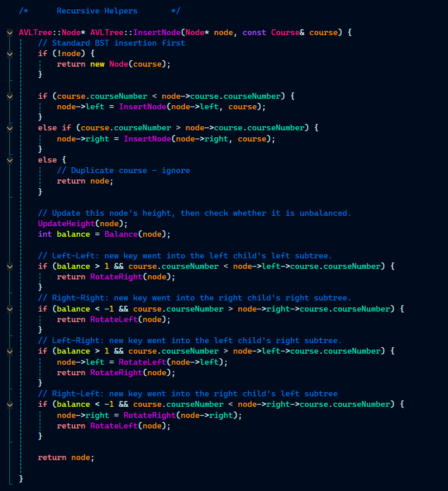
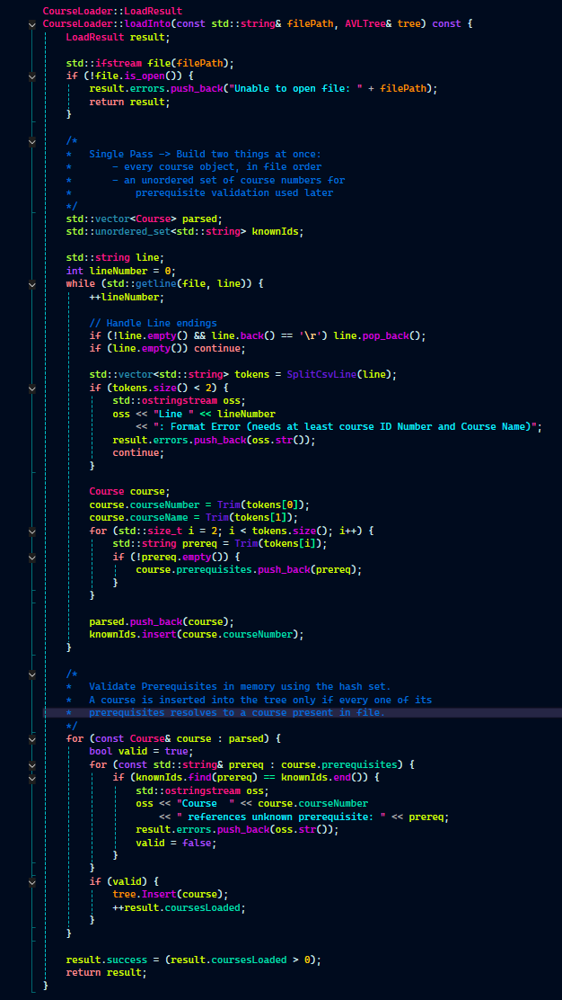
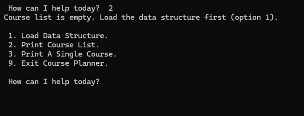
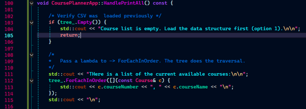

[](https://isocpp.org)
[](https://visualstudio.microsoft.com)
[](https://en.wikipedia.org/wiki/AVL_tree)

---

## Enhancement Two: Algorithms and Data Structures
### Course Planner &mdash; CS-300 DSA: Analysis and Design

---

<div align="center">
  <a href="https://github.com/DPHarmon/DPHarmon.github.io/tree/main/enhancement/CS300-CoursePlanner" title="Course Planner source">
    
  </a>
  <a href="docs/TDD_EnhancementTwo.docx" title="Technical Design Document">
    
  </a>
</div>

### The artifact

The Course Planner comes from Project Two, the final project of my CS-300
course, written in August 2025. It is a console-based C++ program that reads a
CSV of academic courses and their prerequisites, stores them in a binary search
tree, and offers a menu-driven interface to load the file, print every course in
alphanumeric order, or look up a single course with its prerequisites.

The original validated prerequisites by parsing the CSV twice: copying every
course ID into an array, running a QuickSort over it, then binary searching for
each prerequisite reference. That algorithmic choice is the main reason I chose
this artifact.

### Why this artifact

Two reasons. First, data structures and algorithms is the material I enjoyed
most in the program, and I wanted to show that I can take a weak algorithmic
design and make it faster.

Second, I wanted to show what a year of coursework changed in how I write code.
During the code review I struggled with my own artifact because all of it lived
in a single file. Hunting down any one piece of logic meant scrolling past
everything else, and the program followed no separation of concerns
([Ref 1](https://www.geeksforgeeks.org/software-engineering/separation-of-concerns-soc/)).
The tree had no self-balancing logic, so search performance depended on the
order courses happened to appear in the CSV. Being a small program, it was the
right size to rebuild around the engineering practices and architectural
patterns I have learned since.

---

### The AVL tree

The self-balancing AVL tree &mdash; named for Georgy Adelson-Velsky and Evgenii
Landis &mdash; guarantees O(log n) insert and search regardless of input order.
I implemented the height field, the balance-factor check, all four rebalancing
cases (Left-Left, Right-Right, Left-Right, Right-Left), and the two rotation
primitives.

The node type, height tracking, and rotation logic are private. Callers only
interact with `Insert`, `Find`, and `ForEachInOrder`. That encapsulation is
deliberate and enforced by the class boundary.

<div align="center">
  
  <p><em>Figure 1 - Balance-factor check and the four rebalancing cases</em></p>
</div>

The AVL height invariant keeps the tree within a constant factor of log&#8322;n,
bounded by 1.44 &times; log&#8322;(n + 2). Rotations are constant-time pointer
updates, and at most one rotation (or one double rotation) is performed per
insertion.

### One pass instead of two

`CourseLoader` replaces the two-pass QuickSort and binary search with a single
file pass into memory, backed by a hash set of course IDs for O(1) prerequisite
lookup. Because the set is populated during the same pass that reads the file,
no second read is needed.

The loader collects malformed rows and unresolved prerequisites into a
`LoadResult` for the application layer to display, which means it has no
dependency on `iostream` at all.

<div align="center">
  
  <p><em>Figure 2 - Single-pass load with hash-set prerequisite validation</em></p>
</div>

#### Runtime comparison

| | Original | Enhanced |
|:---|:---|:---|
| File passes during load | 2 | 1 |
| Prerequisite validation | QuickSort + binary search &mdash; O(np log n) | Hash set lookup &mdash; O(np) |
| Insert, average case | O(log n) | O(log n) |
| Insert, worst case | O(n) | O(log n) |
| Load, total | O(n log n) | O(n log n) |

The trade-offs are real and worth naming. The AVL adds a height field per node
and a rotation cost per insert in exchange for eliminating the worst case. The
hash set adds memory overhead in exchange for eliminating the sort. The full
line-by-line cost tables and the memory analysis are in the Technical Design
Document linked above.

### Layered architecture

The original single file became five files organized by responsibility. This was
not in my Module One enhancement plan &mdash; it only became obvious after the
code review.

```
CoursePlanner/
├── main.cpp                    → entry point only
├── Course.h                    → domain model
├── AVLTree.h / AVLTree.cpp     → data structure layer
├── CourseLoader.h / .cpp       → data access layer (CSV parsing + validation)
└── CoursePlannerApp.h / .cpp   → application layer (menu, user interaction)
```

<div align="center">
  
  <p><em>Figure 3 - The application layer, isolated from data access and storage</em></p>
</div>

Separating the layers removed the global state and made the program testable.
The CSV format can be changed by editing one file. UI can be added without
touching data logic.

### Defensive input handling

The code review exposed a lack of checks. If the course list was empty or the
file had not loaded, the user got no explanation at all. The enhanced version
guards both operations with a message directing the user back to the load
option, and recovers from non-numeric menu input instead of falling into an
infinite loop.

<div align="center">
  
  <p><em>Figure 4 - The app explains what to do when no data has been loaded</em></p>
</div>

<div align="center">
  
  <p><em>Figure 5 - Recovery from non-numeric menu input</em></p>
</div>

---

### Course outcomes

**Design and evaluate computing solutions that solve a given problem using
algorithmic principles and computer science practices and standards appropriate
to its solution, while managing the trade-offs involved in design choices.**

The AVL and hash-set choices are both grounded in a Big-O analysis of the
original's inefficiencies, and I can articulate what each one costs as well as
what it buys. That analysis is the substance of the Technical Design Document.

**Design, develop, and deliver professional-quality oral, written, and visual
communications that are coherent, technically sound, and appropriately adapted
to specific audiences and contexts.**

The Technical Design Document is the evidence here: pseudocode for the original
and enhanced implementations, line-by-line cost tables for each, and a memory
analysis covering the tree, the hash set, and the parsed course vector.

**Demonstrate an ability to use well-founded and innovative techniques, skills,
and tools in computing practices for the purpose of implementing computer
solutions that deliver value and accomplish industry-specific goals.**

This is the outcome I did not plan for in Module One. The layered restructure
came out of the code review, and separation of concerns, encapsulation, and the
elimination of global state are standard practices rather than inventions of my
own.

---

### Reflection

What stood out most is how much structure matters, even in a program this small
&mdash; and how much more it will matter in the larger systems I expect to work
on.

For instance when I ran into an infinite loop, the structure helped in debugging.
After rewriting the tree with self-balancing logic, I hit an infinite loop. The
program crashed, and the Visual Studio call stack showed `AVLTree::InsertNode`
called hundreds of times. That pointed me straight at the rotation logic, where
I found an error in `RotateLeft` and, just below it, a pointer to the wrong node
in the Right-Right rebalance check &mdash; `node->left` where it should have
been `node->right`.

Two tiny errors. In the original single-file version I would have been scrolling
the whole program looking for them. Instead the stack trace sent me to one file,
and it took about three minutes to find and fix both.

---

### Sources

[Ref 1] GeeksforGeeks. (2024). *Separation of concerns (SoC)*.
[https://www.geeksforgeeks.org/software-engineering/separation-of-concerns-soc/](https://www.geeksforgeeks.org/software-engineering/separation-of-concerns-soc/)

[Ref 2] Obregon, A. (2023). *AVL trees: an in-depth look*. Medium.
[https://medium.com/@AlexanderObregon/avl-trees-an-in-depth-look-9a0e0481487a](https://medium.com/@AlexanderObregon/avl-trees-an-in-depth-look-9a0e0481487a)

[Ref 3] GeeksforGeeks. (2023). *AVL tree data structure*.
[https://www.geeksforgeeks.org/dsa/introduction-to-avl-tree/](https://www.geeksforgeeks.org/dsa/introduction-to-avl-tree/)

---

<div align="right">
  <a href="/">&#8592; Back to ePortfolio Home</a>
</div>
