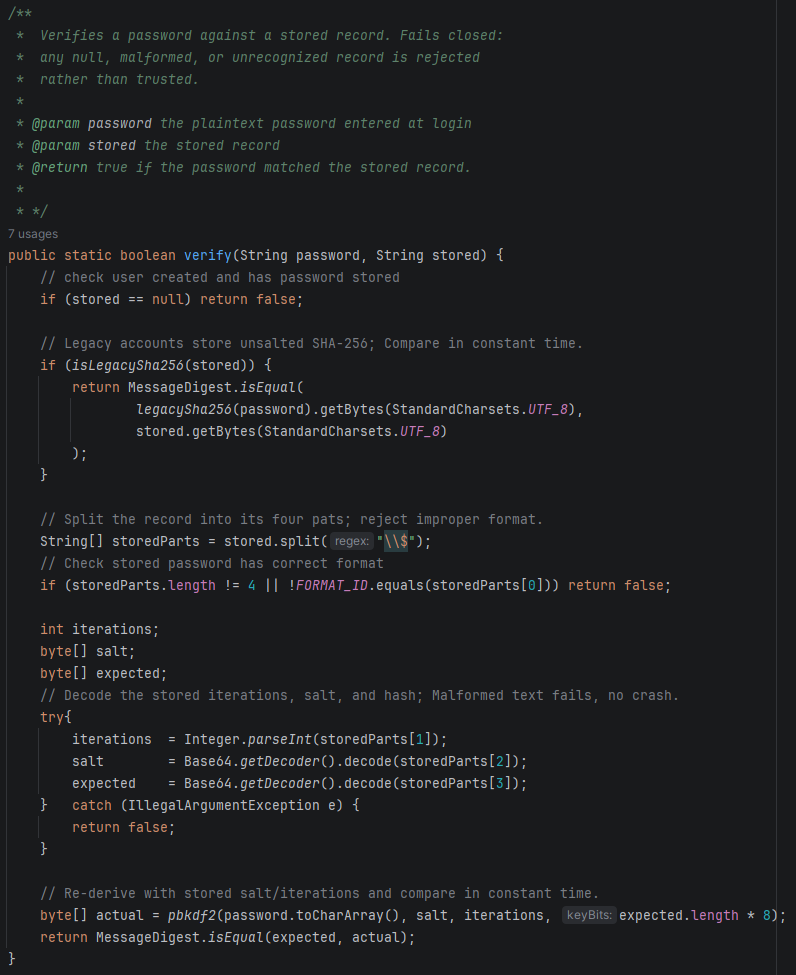
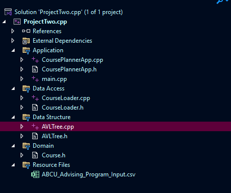
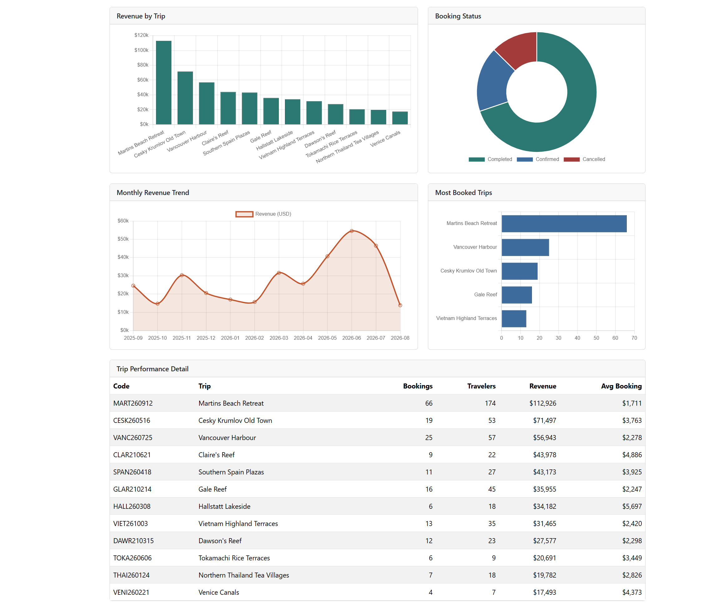

# Dylan Harmon

### Computer Science, B.S. - Southern New Hampshire University

When I started my Computer Science journey at SNHU I would have thought
a program was finished once it was working. This portfolio is a culmination
of one of the most important ideologies that I learned while working on my
B.S. which is *it works* its just the starting point.

The clearest example is in the security enhancement below. Replacing a weak password hash with a strong one can take a day to do. 
Replacing it *without locking out every existing user* is the real problem. Although learning the coding languages, the different architectures, 
data structures, and all the other skills I learned at SNHU are important, I think the most important thing I learned was how to approach a problem, 
and how to ask: *not does this work, but how does this fail and for whom?*  

That question shows up in all three artifact enhancements: a data structure that stays fast 
no matter what order the input arrives in, credentials that upgrade themselves quietly on a 
user's next login, and a dashboard that provides charts based on what stakeholders would conclude 
from them, not just whether the numbers were correct.

My experience is primarily with the following:

  
  
  
  
  
  
  

---

## Contents

- [Professional Self-Assessment](#professional-self-assessment)
- [Code Review](#code-review)
- [Enhancement One: Software Design and Engineering](#enhancement-one-software-design-and-engineering)
- [Enhancement Two: Algorithms and Data Structures](#enhancement-two-algorithms-and-data-structures)
- [Enhancement Three: Databases](#enhancement-three-databases)
- [Course Outcomes](#course-outcomes)

---

## Professional Self-Assessment

I came into the Computer Science program at SNHU in late 2023 as a final chance to find happiness in a career. A newborn, 4 step-children and a marriage within the last year
started to weigh on me. Questions of *Did I want to be a server forever* and thoughts about my 3 years studying to be an Aerospace Engineer. I knew I had a drive to further my education
and to further my career, but recent events instilled a need to be a role model to my children, 
and to genuinely be happy and excited with what I did as a living. I started by just
wanting to learn how to make a program, and I am leaving with the knowledge and ability to tell whether what I built is any good. Now I can say
I am excited for my future and to continue working with and furthering my education in Computer Science. Because now the fun doesn't have to be
in *making it run*, instead the interesting work comes in the questions about *how it behaves under input I did not anticipate, users I did not plan for,
and readers who need something I hadn't anticipated*.

In this Capstone we were tasked with returning to prior work and building an enhancement plan that met certain course outcomes. The place I noticed the most
technical growth was in the before and after of my Course Planner app. It was from one of my first programming classes at SNHU. I was still getting used to IDEs,
I was learning Data Structures and misunderstanding the intricate parts of what I was learning. I would get hyper focused on a single way to achieve something. Last
but not least I had not learned about the importance of structure or separation of concerns. My original artifact is a single file, and during my code review I was
really struggling to see what all the parts did, or why I approached the *problem* in the way I had. Rebuilding it taught me more than writing it the first time did. 
Separating the single file into domain, data structure, data access, and application layers helped immediately when it came to debugging. 

  <a href="#contents">Back to top &#8593;</a>

---

## Code Review

The following video is my code review for the original artifacts. In the Code Review I briefly cover all three artifacts and walk through what the existing code does, where it falls short, and what I planned to do about it.
The code review establishes a baseline and forced me to articulate and discover short comings or potential improvement rather than working from memory.

  
  
<em>Code review of the three original artifacts - CS-499 Capstone</em>

  <a href="#contents">Back to top &#8593;</a>

---

## Enhancement One: Software Design and Engineering

  
  

**The artifact.** The Warehouse Inventory App is an Android application from CS-360 Mobile Architecture and Programming. Warehouse employees create an account and log in, then add, update, and delete items in a local database, and the app sends an SMS alert when an item's quantity reaches zero. It is written in Java on the standard Android stack: SQLite through Room, a repository and ViewModel following MVVM, and RecyclerView-driven screens.

**Why it is here.** The structure was already sound. The weakness was in how the app handled credentials and input, which made it the right candidate for a security enhancement rather than a rewrite. It let me demonstrate refactoring existing code toward a different authentication design instead of building something new and calling it an improvement.

**What I changed.** I replaced the original unsalted SHA-256 password hash with salted, iterated PBKDF2-HMAC-SHA256, stored in a self-describing record so its parameters can evolve without a database migration, and verified with a constant-time comparison. Accounts created under the old scheme still authenticate and are transparently upgraded on their next login through lazy migration. I also tightened the manifest to the principle of least privilege, moved the runtime SMS request to the current `ActivityResultLauncher` API with handling for the permanently-denied case, and added a `Validators` class enforcing rules on every input before it reaches the database.

  
  
<em>Figure 1 - Password verification with constant-time comparison</em>

**Outcomes met.** Security mindset, algorithmic trade-offs, and well-founded techniques. The full reasoning behind the PBKDF2 work factor, the lazy migration path, and the JUnit coverage is in the [full write-up](Enhancement-One).

  <a href="#contents">Back to top &#8593;</a>

---

## Enhancement Two: Algorithms and Data Structures

  
  

**The artifact.** The Course Planner is a console-based C++ program from CS-300 DSA: Analysis and Design. It reads a CSV of academic courses and their prerequisites, stores them in a binary search tree, and offers a menu to load the file, print every course in alphanumeric order, or look up a single course.

**Why it is here.** The original validated prerequisites by parsing the CSV twice, copying every course ID into an array, running a QuickSort, then binary searching for each reference. The tree had no self-balancing logic, so search performance depended on the order courses happened to appear in the file. All of it lived in one file, which I felt during the code review when hunting down any single piece of logic meant scrolling past everything else.

**What I changed.** I converted the binary search tree to a self-balancing AVL tree, guaranteeing O(log n) insert and search regardless of input order. The two-pass QuickSort and binary search became a single file pass backed by a hash set for O(1) prerequisite lookup. The single file became five, organized by responsibility: domain model, data structure layer, data access layer, application layer, and an entry point that only builds and runs the app. I also added guards for the empty-list and file-not-loaded cases and recovery from non-numeric menu input.

  
  
<em>Figure 2 - The application layer, isolated from data access and storage</em>

**Outcomes met.** Algorithmic trade-offs, professional communication, and well-founded techniques. The Technical Design Document, with pseudocode and line-by-line cost tables for both implementations, is linked from the [full write-up](Enhancement-Two).

  <a href="#contents">Back to top &#8593;</a>

---

## Enhancement Three: Databases

  
  

**The artifact.** Travlr Getaways is a MEAN stack travel booking application from CS-465 Full Stack Development I. Three parts share one Express server: a customer-facing site rendered with Handlebars, a REST API backed by MongoDB, and an Angular single-page application for admins to manage the trip catalog.

**Why it is here.** It is the only artifact I have with a working database and API already in place. The original schema held only trips and users, there were three trips in the seed file, and the queries were simple CRUD. That left it as a set of building blocks rather than a finished data layer, which gave me a collection to design from nothing and a query layer that has to justify the design.

**What I changed.** I added a bookings collection that references trips and users by `ObjectId` rather than embedding them, with three indexes each mapping to a specific query. I wrote a seed generator that produces eighteen months of history weighted by season, growth, and a jitter factor, with statuses that resolve consistently against how long ago each booking was placed. Four aggregation pipelines expose revenue by trip, monthly revenue, top trips, and cancellation rate as protected endpoints. An Angular standalone component renders them as four Chart.js visualizations with a detail table below.

  
  
<em>Figure 3 - The completed analytics dashboard</em>

**Outcomes met.** Collaborative environments, professional communication, and well-founded techniques. The pipeline-by-pipeline reasoning, including why each `$lookup` runs where it does, is in the [full write-up](Enhancement-Three).

  <a href="#contents">Back to top &#8593;</a>

---

## Course Outcomes

| # | Outcome | Where it is demonstrated |
|:---:|:---|:---|
| 1 | Employ strategies for building collaborative environments that enable diverse audiences to support organizational decision making | **Enhancement Three.** The aggregation layer turns a collection a stakeholder could not read into figures and charts that someone in sales or leadership can act on. |
| 2 | Design, develop, and deliver professional-quality oral, written, and visual communications adapted to specific audiences and contexts | **Enhancement Two** &mdash; the Technical Design Document, with pseudocode and cost tables for both implementations. **Enhancement Three** &mdash; deliberate chart selection, abbreviated axes, summary cards above distributions, and a detail table for the precision a chart discards. |
| 3 | Design and evaluate computing solutions using algorithmic principles and computer science practices, while managing the trade-offs involved in design choices | **Enhancement Two** &mdash; the AVL and hash-set choices, grounded in a Big-O analysis of the original. **Enhancement One** &mdash; the PBKDF2 work factor, balanced against login latency on a mobile device. |
| 4 | Demonstrate an ability to use well-founded and innovative techniques, skills, and tools in computing practices | **All three.** PBKDF2 through Java's `SecretKeyFactory` and lazy migration; separation of concerns and the elimination of global state; the MongoDB aggregation framework used as intended rather than computing results in application code. |
| 5 | Develop a security mindset that anticipates adversarial exploits in software architecture and designs to expose potential vulnerabilities, mitigate design flaws, and ensure privacy and enhanced security of data and resources | **Enhancement One.** Offline brute force, timing side channels, injection-style input, and denial of service through an oversized password &mdash; each mitigation is a response to a specific attack. |

  <a href="#contents">Back to top &#8593;</a>

